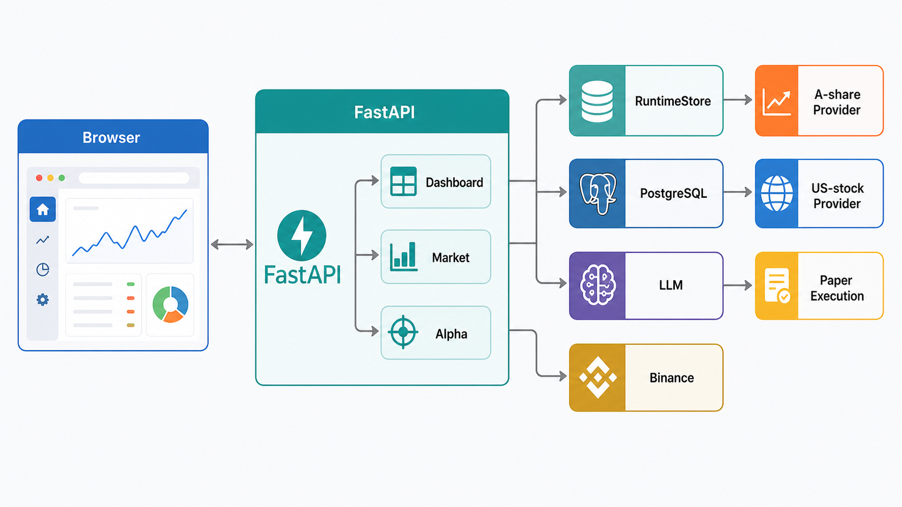
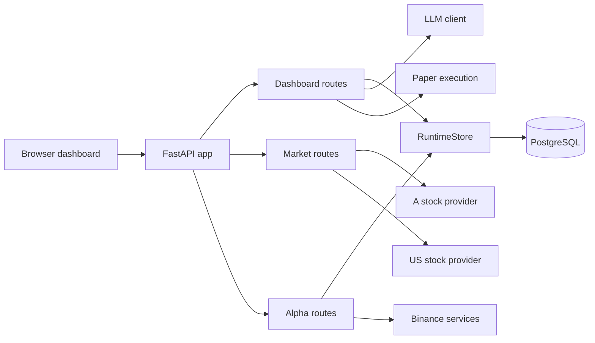
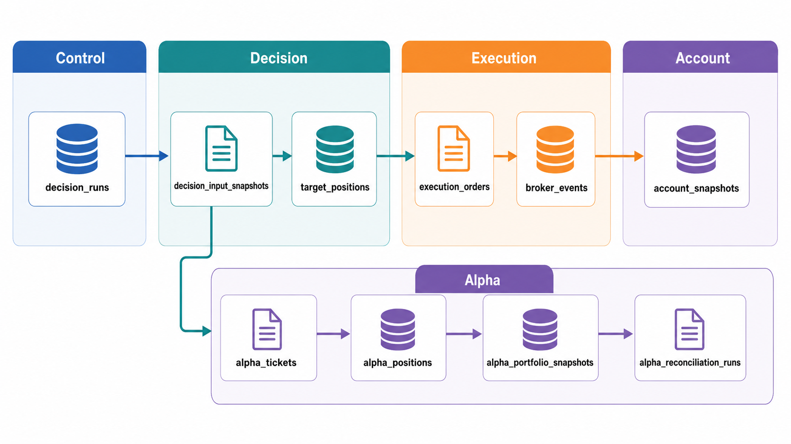
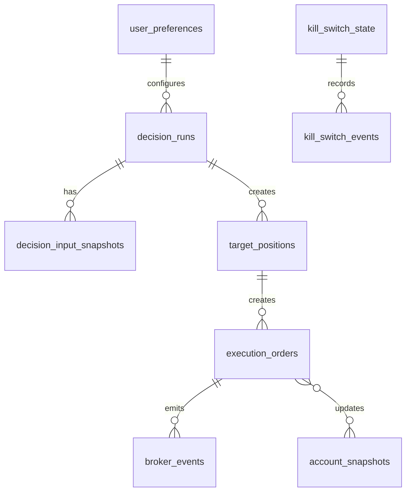
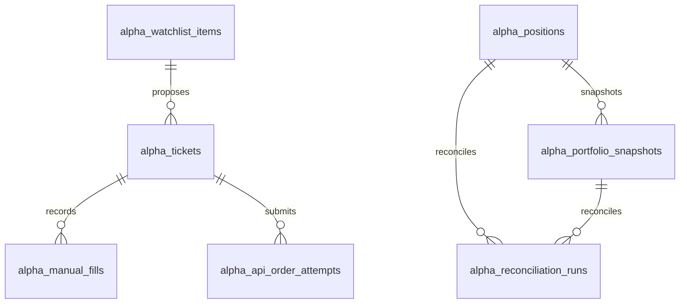
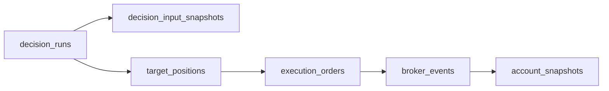

# A Share Hub Architecture

本文面向技术读者和有一点基础的新手，说明当前代码里的系统架构、数据库表模型关系、页面布局和主要流程。这里描述的是当前实现，不把计划文档中的功能写成已落地功能。

## 1. 系统总览

`a-share-hub` 是一个以 FastAPI 为后端、单页 dashboard 为前端、PostgreSQL 为运行态存储的交易演练系统。入口在 `src/main.py`，`build_app()` 挂载健康检查、工作台、行情、交易链路、Kill Switch、Alpha、美股和 A 股等路由。

先看整体结构图，再看下面的模块拆解。

核心模块如下：

| 模块 | 当前职责 | 主要代码 |
|---|---|---|
| FastAPI 服务 | 组装 API、CLI 和 dashboard 页面 | `src/main.py` |
| Dashboard | 工作台、A 股页、美股页、Alpha 页的 HTML 和 JS | `src/api/routes_dashboard.py`, `src/api/dashboard_page/*` |
| PostgreSQL | 保存运行控制、决策、目标仓位、订单、事件、账户快照、偏好和 Alpha 数据 | `src/storage/models.py`, `src/storage/runtime_store.py`, `alembic/versions/*.py` |
| 行情 Provider | A 股使用 AkShare catalog 加腾讯行情和 K 线，美股使用 yfinance，部分美股列表和指数使用 Stooq | `src/data/providers/akshare_provider.py`, `src/us_stock/yahoo_provider.py`, `src/api/routes_market.py` |
| LLM | DeepSeek 或 mock，失败时降级为 HOLD 决策 | `src/agents/llm_client.py` |
| 执行和对账 | 工作台主流程使用纸面执行，写订单、Broker Event 和账户快照；对账状态从订单和事件派生 | `src/execution/paper_execution_service.py`, `RuntimeStore.get_reconciliation_status()` |
| Alpha 模块 | Alpha 资产、研究扫描、建议单、人工成交、接口下单尝试、组合和对账 | `src/api/routes_alpha.py`, `src/alpha/*` |

## 2. 数据库模型分组

当前 ORM 主模型集中在 `src/storage/models.py`。A 股和美股自选表由迁移创建，但没有放进这个 SQLAlchemy models 文件；它们分别由 `src/a_stock/watchlist.py` 和 `src/us_stock/watchlist.py` 通过 psycopg 直接访问。

### 2.1 运行控制

| 表 | 用途 |
|---|---|
| `kill_switch_state` | 当前全局 Kill Switch 状态。工作台运行前会检查它，激活时阻断交易动作。 |
| `kill_switch_events` | Kill Switch 启用或解除的审计事件。 |
| `user_preferences` | 保存 dashboard 偏好，例如观察列表、市场、资金和执行模式。 |
| `execution_plans` | 早期执行计划表，保存可被执行节点消费的 READY 计划。 |

### 2.2 决策链路

| 表 | 用途 |
|---|---|
| `decision_runs` | 每个标的一次 LLM 或 mock 决策结果，包括动作、置信度、目标仓位比例和理由。 |
| `decision_input_snapshots` | 每次决策使用的输入上下文 JSON。通过 `decision_run_id` 逻辑关联 `decision_runs`。 |
| `target_positions` | 决策后希望达到的目标仓位金额、比例和有效期。通过 `decision_run_id` 逻辑关联 `decision_runs`。 |

### 2.3 执行链路

| 表 | 用途 |
|---|---|
| `execution_orders` | 由目标仓位转成的执行订单，记录方向、数量、限价、状态和券商订单 ID。 |
| `broker_events` | 券商或模拟券商事件流水，`order_id` 通常对应 `execution_orders.execution_order_id`。 |
| `risk_gate_events` | 风控事件表。当前 dashboard 运行会做风控判断，但该主流程没有把每次判断写入此表。 |

### 2.4 账户和对账

| 表 | 用途 |
|---|---|
| `account_snapshots` | 模拟账户快照，记录现金、NAV 和持仓 JSON。纸面执行完成后写入。 |
| `broker_events` | 同时参与对账状态计算。当前 `get_reconciliation_status()` 根据未完成订单和事件数量派生健康状态。 |

当前 A 股工作台没有单独的 `reconciliation_runs` 表；对账结果是从 `execution_orders` 和 `broker_events` 即时计算出来的。

### 2.5 A 股和美股自选

| 表 | 用途 | 访问代码 |
|---|---|---|
| `a_share_watchlist` | A 股自选股列表，字段包括 `id`, `symbol`, `name`, `sort_order`, `created_at`。 | `src/a_stock/watchlist.py` |
| `us_watchlist` | 美股自选股列表，字段同上。 | `src/us_stock/watchlist.py` |

这些表由 `alembic/versions/20260602_000006_add_us_watchlist_table.py` 和 `alembic/versions/20260603_000007_add_a_share_watchlist_table.py` 创建。它们用于行情页和工作台观察列表同步。

### 2.6 日频纸面账本（paper_ledger）

| 表 | 用途 |
|---|---|
| `paper_accounts` | 按 `market + account_kind` 唯一的账户，`account_kind` 为 `auto` 或 `manual`。 |
| `paper_runs` | 每次运行一条记录，含市场、交易日、来源（auto/manual/backfill）、状态、参数快照。 |
| `paper_positions` | 当前持仓，按账户维度维护。 |
| `paper_fills` | 模拟成交明细，成交价按前收盘价。 |
| `paper_nav_daily` | 每日净值快照（nav/cash/positions_value），含 `run_id` 和 `source` 字段区分来源。 |

`paper_nav_daily` 是累计曲线和区间表现的唯一权威数据源。`source` 字段区分 `auto`（真实自动运行）、`manual`（手动试跑）和 `backfill`（启动补算的历史数据）。

### 2.7 调度器（scheduler）

`src/scheduler/daily_scheduler.py` 使用 APScheduler 注册两个 cron job：
- `a_share_daily`：周一至周五 09:15（北京时间）
- `us_daily`：周一至周五 21:15（北京时间）

启动时 `src/main.py` 的 lifespan 钩子先启动调度器，再触发 `needs_backfill` / `backfill_recent_days` 补算流程。

### 2.8 Alpha 工单与组合

| 表 | 用途 |
|---|---|
| `alpha_watchlist_items` | Alpha 研究观察列表，保存标的、底层标的和优先级。 |
| `alpha_tickets` | Alpha 交易建议单，保存资产、底层标的、方向、理由、建议数量、限价、状态和审批人。 |
| `alpha_manual_fills` | 人工成交记录，通过 `ticket_id` 逻辑关联建议单。 |
| `alpha_api_order_attempts` | Alpha API 下单尝试，通过 `ticket_id` 逻辑关联建议单，保存请求模式、状态和响应。 |
| `alpha_positions` | Alpha 当前持仓，按 `symbol` 作为主键。 |
| `alpha_portfolio_snapshots` | Alpha 组合快照，保存现金、已实现 PnL、未实现 PnL 和 NAV。 |
| `alpha_reconciliation_runs` | Alpha 对账运行记录，保存来源、状态和差异 JSON。 |

先看一张数据库关系图，再看下面的正式关系说明。

## 3. 数据表关系

注意：下面是代码当前使用的逻辑关系。`src/storage/models.py` 和现有迁移没有声明外键约束，所以这不是数据库强制关系图。

主交易链路最重要的一条路径是：

## 4. 页面布局和数据来源

Dashboard 页面由 `src/api/dashboard_page/render.py` 拼装。它读取 `shell.html`，把 partial、CSS 和 JS 内联进去。导航条来自 `status_bar.html`，四个主视图分别是工作台、A 股、Alpha、美股。

| 用户看到的区域 | Partial | Script | 主要 API | 相关表 |
|---|---|---|---|---|
| 顶部状态条 | `partials/status_bar.html` | `scripts/dashboard.js` | `GET /api/v1/dashboard/workbench`, `GET /api/v1/kill-switch/status` | `kill_switch_state`, `kill_switch_events` |
| 工作台顶部状态栏 | `partials/view_dashboard.html` | `scripts/dashboard.js` | `GET /api/v1/dashboard/workbench?market=a&account_kind=auto` | `user_preferences`, `kill_switch_state` |
| 工作台左侧命令面板 | `partials/view_dashboard.html` | `scripts/bootstrap.js` | `PUT /api/v1/dashboard/preferences`, `POST /api/v1/dashboard/run` | `user_preferences`, `decision_runs`, `target_positions`, `execution_orders` |
| 工作台中央性能面板 | `partials/view_dashboard.html` | `scripts/dashboard.js` | `GET /api/v1/dashboard/performance?market=a&window=30d`, `GET /api/v1/dashboard/history?market=a&source=all` | `paper_nav_daily`, `paper_runs` |
| 工作台右侧风控面板 | `partials/view_dashboard.html` | `scripts/dashboard.js` | `GET /api/v1/dashboard/automation?market=a`, `GET /api/v1/dashboard/workbench` | `paper_runs`, `paper_nav_daily`, `target_positions` |
| 工作台底部历史台账 | `partials/view_dashboard.html` | `scripts/dashboard.js` | `GET /api/v1/dashboard/history?market=a&source=all&limit=20` | `decision_runs`, `execution_orders`, `kill_switch_events` |
| A 股行情页 | `partials/view_market.html` | `scripts/market.js` | `GET /api/v1/market/stocks`, `GET /api/v1/a-stock/watchlist`, `POST /api/v1/a-stock/watchlist`, `DELETE /api/v1/a-stock/watchlist/{symbol}`, `POST /api/v1/a-stock/quotes`, `GET /api/v1/a-stock/kline/{symbol}`, `GET /api/v1/a-stock/fundamental/{symbol}` | `a_share_watchlist` |
| 美股页 | `partials/view_us_stock.html` | `scripts/us_stock.js` | `GET /api/v1/us-stock/quotes`, `GET /api/v1/us-stock/search`, `GET /api/v1/us-stock/watchlist`, `POST /api/v1/us-stock/watchlist`, `DELETE /api/v1/us-stock/watchlist/{symbol}`, `GET /api/v1/us-stock/kline/{symbol}`, `GET /api/v1/us-stock/fundamental/{symbol}`, `GET /api/v1/us-stock/binance/assets` | `us_watchlist` |
| Alpha 区域 | `partials/view_alpha.html` | `scripts/alpha.js` | `GET /api/v1/dashboard/workbench`, `GET /api/v1/alpha/assets`, `POST /api/v1/alpha/tickets`, `POST /api/v1/alpha/research/scan`, `POST /api/v1/alpha/research/propose-top-ticket`, `GET /api/v1/alpha/capabilities` | `alpha_tickets`, `alpha_watchlist_items`, `alpha_positions`, `alpha_portfolio_snapshots`, `alpha_reconciliation_runs` |

页面和 API 的关键点：

- `GET /dashboard` 只返回拼好的 HTML。
- `GET /api/v1/dashboard/workbench?market=a&account_kind=auto` 是工作台读模型的聚合接口，同时把 Alpha 面板数据放在 `payload["alpha"]`。
- `GET /api/v1/dashboard/performance?market=a&window=30d` 返回净值曲线和区间表现对比卡片。
- `GET /api/v1/dashboard/automation?market=a` 返回自动交易状态（今日状态、最后运行、下次运行）。
- `GET /api/v1/dashboard/history?market=a&source=all&limit=20` 返回运行历史，`source` 支持 `auto`/`manual`/`backfill`/`all`。
- `POST /api/v1/dashboard/run` 是手动沙盒触发，结果只写 `manual` 账户，不影响 `auto` 业绩曲线。
- 响应模型定义在 `src/api/dashboard_contracts.py`。
- A 股和美股行情页面主要读取实时 provider，行情本身不持久化；持久化的是自选列表。

## 5. 关键流程

### 5.1 一次模拟交易

1. 用户在工作台填写资金、观察列表、单票仓位、止损阈值、决策模式和执行模式。
2. `scripts/dashboard.js` 调用 `POST /api/v1/dashboard/run`。
3. 后端先检查 `kill_switch_state`。如果 Kill Switch 激活，直接返回当前工作台 payload，不继续产生交易动作。
4. 后端为每个 symbol 拉取实时价格。A 股路径使用 `AkshareProvider`，失败时用 `100.0` 作为兜底价格。
5. 后端生成决策。真实模式调用 `LLMClient`，mock 模式生成固定 BUY、HOLD、SELL 模式。每个决策写入 `decision_runs`，同时写入一条 `decision_input_snapshots`。
6. `build_target_positions()` 把决策转换为目标仓位，写入 `target_positions`。
7. `evaluate_risk_gate()` 检查现金、仓位比例、手数、Kill Switch 等条件。当前工作台流程只用检查结果决定是否进入执行，没有持久化到 `risk_gate_events`。
8. 如果执行模式是完整链路，`PaperExecutionService.execute_targets()` 为通过风控的目标写 `execution_orders`，写 `SUBMITTED` 和 `FILLED` 两类 `broker_events`，把订单状态更新为 `FILLED`，最后写 `account_snapshots`。
9. `GET /api/v1/dashboard/workbench` 或本次 run 响应把最新运行时间线、风险状态和历史表格返回给前端。

### 5.2 一次市场扫描

A 股扫描：

1. 页面点击“全市场扫描”，调用 `POST /api/v1/dashboard/scan`。
2. 后端通过 `AkshareProvider.get_stock_list()` 获取股票目录。
3. `scan_market()` 批量拉腾讯行情并做第一轮筛选。
4. `confirm_buy_candidates()` 用历史 K 线确认 BUY 候选。
5. 结果返回页面，不写 `decision_runs`、`target_positions` 或订单表。

美股扫描：

1. 页面市场选择为美股时调用 `POST /api/v1/dashboard/scan-us`。
2. 后端读取 `us_watchlist` 作为扫描股票池。
3. `YahooProvider.get_quotes()` 提供行情，`confirm_us_buy_candidates()` 用 K 线确认。
4. 结果同样只返回页面，不持久化成交易链路记录。

### 5.3 一次回测

1. 用户在工作台选择开始日期、结束日期和观察列表。
2. 前端调用 `POST /api/v1/dashboard/backtest`。
3. 后端按市场选择数据源：A 股走 `AkshareProvider.get_history()`，美股走 `YahooProvider.get_kline()`。
4. 后端计算技术特征，调用 `build_signal()` 生成日频信号，再用 `run_daily_backtest()` 和 `calculate_metrics()` 计算收益、回撤和交易次数。
5. 回测结果返回页面显示。当前实现没有回测结果表，因此不会写 PostgreSQL。

### 5.4 一次 Alpha 工单和对账

1. Alpha 页加载时调用 `GET /api/v1/dashboard/workbench`，读取建议单、组合快照、持仓、观察列表和最近对账状态。
2. 用户可手动录入建议单，`POST /api/v1/alpha/tickets` 写 `alpha_tickets`。
3. 用户也可运行 `POST /api/v1/alpha/research/scan`，后端读取 `alpha_watchlist_items`，通过 Binance 历史 K 线和 `AlphaSignalEngine` 给候选排序。扫描本身不落表。
4. 点击“生成建议单”会调用 `POST /api/v1/alpha/research/propose-top-ticket`，把排序第一的候选转为 `alpha_tickets`。
5. API 支持审批和人工成交：`POST /api/v1/alpha/tickets/{ticket_id}/approve` 更新工单状态，`POST /api/v1/alpha/tickets/{ticket_id}/fills` 写 `alpha_manual_fills`。
6. API 支持订单预览和提交：`POST /api/v1/alpha/orders/preview` 只返回提交预览，`POST /api/v1/alpha/orders/submit` 在能力开启时写 `alpha_api_order_attempts`。
7. Alpha 对账调用 `POST /api/v1/alpha/reconciliation/run`。后端比较 `alpha_positions` 和外部持仓、最新 `alpha_portfolio_snapshots.cash_balance` 和外部现金，写入 `alpha_reconciliation_runs`。

## 6. 新手名词解释

| 名词 | 大白话解释 |
|---|---|
| 影子模式 | 系统按真实流程演练，但不会发真实交易指令。当前工作台默认显示为影子模式。 |
| Kill Switch | 紧急停止开关。激活后，工作台 run 不再继续产生交易动作。 |
| 目标仓位 | 决策后希望账户达到的仓位，比如某只股票目标占账户 10%。 |
| 执行订单 | 为了达到目标仓位而生成的订单，比如买入 100 股某股票。 |
| Broker Event | 券商或模拟券商返回的事件流水，比如订单已提交、已成交。当前纸面执行会写 `SUBMITTED` 和 `FILLED`。 |
| 对账 | 把系统内记录和外部账户或执行结果核对，确认订单、持仓、现金有没有差异。 |
| NAV | Net Asset Value，净资产价值。简单理解就是现金加持仓市值。 |
| PnL | Profit and Loss，盈亏。已实现 PnL 是卖出后确认的盈亏，未实现 PnL 是当前持仓按市价估算的浮动盈亏。 |
| Watchlist | 观察列表或自选列表。用户关注的股票或 Alpha 标的集合。 |

## 7. 维护建议

新增或修改表、字段、接口和页面时，建议按同一次改动完整收敛：

1. 更新权威模型或访问层。主运行态表更新 `src/storage/models.py` 和 `src/storage/runtime_store.py`；A 股和美股自选表更新对应 `watchlist.py`；Alpha 业务更新 `src/alpha/*` 和 `src/api/routes_alpha.py`。
2. 新增 Alembic 迁移。结构变化要有 `op.create_table()`、`op.add_column()` 或索引变更；字段语义变化也要同步数据库注释迁移。
3. 同步数据库注释。当前 `20260606_000008_comment_database_schema.py` 维护表和字段注释，新增表字段时应补齐注释，避免 DBA 或后续 agent 看不懂。
4. 同步调用方。页面 partial、JS、API 路由、RuntimeStore 方法和测试要一起改，不留下旧路径。
5. 同步本文档。表模型、关系图、页面到 API 的映射和关键流程如果变了，要更新 `docs/architecture.md`。
6. 补直接相关测试或最小验证命令。至少覆盖新增字段的写入、读取、页面 API payload 和迁移可执行性。

如果某个旧表、旧字段或旧接口被替换，默认不要保留双轨兼容路径；应把调用方和文档一起收敛到一个权威实现。
