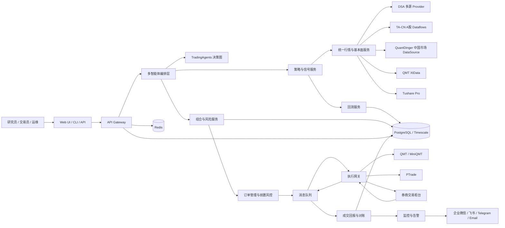

# 四个 GitHub 项目比较与 A 股自动交易整合方案研究报告

## 执行摘要

对这四个仓库做工程化比较后，可以得出一个很清晰的结论：**没有任何一个项目可以单独直接落地为“面向中国 A 股、分钟级或更低频、可生产上线”的自动交易系统**。这四个项目分别在不同层面更强：`TauricResearch/TradingAgents` 强在多智能体研究与决策编排；`hsliuping/TradingAgents-CN` 强在中文化与 A/H/美股数据流、运营化后端与模拟交易；`ZhuLinsen/daily_stock_analysis` 强在 A 股数据接入、回测、持仓台账、任务调度与告警；`brokermr810/QuantDinger` 则最接近“研究—策略—回测—执行”闭环，并且已经有实盘运行时、挂单 worker、组合监控与多券商接入模式，但其现成实盘链路主要指向加密、IBKR、MT5、Alpaca，而不是中国 A 股券商。citeturn18view1turn33view2turn16view1turn28view4turn31view0

从可实施性看，**最可行的整合路线**不是“选择一个仓库做大”，而是“按能力分层整合”：把 `TradingAgents` 作为**多智能体决策内核**，把 `daily_stock_analysis` 作为**A 股数据、回测、持仓与告警底座**，把 `QuantDinger` 作为**执行运行时与 OMS/任务编排参考实现**，而把 `TradingAgents-CN` 作为**A 股数据流与中文化组件来源**。其中最重要的非功能性约束是：`TradingAgents-CN` 明确采用**混合许可证**，`app/` 与 `frontend/` 属于需商业授权的专有部分，因此不能把这些目录当作默认可直接复用的开源基础设施；而 `TradingAgents`、`QuantDinger`、`daily_stock_analysis` 分别为 Apache-2.0、Apache-2.0、MIT，更适合作为主干工程的代码来源。citeturn33view3turn2view3turn2view4turn1view6

如果目标是 A 股分钟级或更低频自动交易，建议采用**研究/回测在 Linux 容器，实际下单在独立 Windows 执行节点**的混合架构。原因很直接：迅投官方知识库说明 `XtQuant` 运行前需先启动 `MiniQMT` 客户端，`XtData`/`XtTrader` 分别提供行情与交易接口；这决定了若选 QMT/miniQMT 作为 A 股执行网关，执行侧通常要与客户端环境绑定。与此同时，中国证监会及沪深交易所对程序化交易已经形成正式监管框架，要求程序化交易遵守报告、合规风控、信息系统和异常交易监管要求；即便你的目标频率只有分钟级，也仍然需要风控闸门、审计日志、人工熔断和券商侧报备能力。citeturn40view1turn40view0turn40view2turn35search8turn40view6turn40view7turn36search2

一句话总结：**推荐以 `TradingAgents + daily_stock_analysis + QuantDinger` 为主组合，谨慎吸收 `TradingAgents-CN` 的开源部分；先完成 A 股数据统一、回测一致性、模拟盘与风控，再接入 QMT/Ptrade 等 A 股券商执行适配器。**citeturn18view1turn25view0turn31view0turn33view3

## 核心结论与总体比较

| 项目 | 项目定位 | 关键技术栈 | A 股数据现状 | 回测/组合现状 | 实盘/下单现状 | 许可协议 | 活跃度快照 | 综合判断 |
|---|---|---|---|---|---|---|---|---|
| TradingAgents-CN | 中文增强版多智能体股票分析学习平台，强调合规友好、支持 A/H/美股分析与教学；后端已从 Streamlit 迁移到 FastAPI，前端为 Vue 3，数据库为 MongoDB + Redis，并提供模拟交易、筛选、自选、通知等运营化能力。 citeturn33view0turn33view1turn33view2 | FastAPI + Uvicorn、Vue 3 + Vite + Element Plus、MongoDB + Redis、REST + WebSocket、Docker 多架构。 citeturn33view1turn33view7 | 很强。`tradingagents/dataflows` 已包含 `providers/china/tushare.py`、`akshare.py`、`baostock.py`、`tdx.py` 等。 citeturn21view0 | 有模拟交易、筛选、同步、队列、任务调度、进度跟踪，但 README 未把“生产级回测框架”作为核心卖点，Issue 中还有用户请求“支持写策略回测”。 citeturn33view2turn10view0 | README 明确定位为学习与研究用途，不提供实盘交易指令；代码层面可见 `paper.py`，但未见 A 股券商路由。 citeturn33view3turn24view0 | 混合许可证；除 `app/` 和 `frontend/` 外为 Apache 2.0，`app/` 与 `frontend/` 为专有部分。 citeturn33view3 | 最近提交为 2026-04-20；最近 issue 为 2026-05-21；最近 PR 为 2026-05-17；开 issue 205、开 PR 51。 citeturn44view0turn10view0turn8view0 | **适合拿来做 A 股数据流、中文化与部分运营后端参考，但不适合作为无授权前提下的主系统骨架。** citeturn21view0turn33view3 |
| QuantDinger | 可自托管“量化操作系统”，覆盖 AI 研究、Python 原生策略、回测、快速交易和实盘；支持 Agent/MCP、多用户、策略运行时、挂单 worker。 citeturn28view4turn28view0turn14view1 | Nginx + Vue 前端镜像、Flask API、PostgreSQL 16、Redis 7、Docker Compose。 citeturn28view1turn28view3turn28view7 | 中等偏强。代码里有 `cn_stock.py`、`asia_stock_kline.py`、`cn_hk_fundamentals.py`、`tencent.py`，说明已具备中港市场数据适配基础。 citeturn31view1 | 强。后端 README 与代码均包含回测、策略快照、策略运行时、组合监控、挂单 worker。 citeturn14view1turn31view0 | 强，但现成实盘主要是加密、IBKR、MT5、Alpaca；A 股执行没有现成官方接入，Issue 中已有用户专门提 A-share 支持诉求。 citeturn28view4turn28view6turn11view0 | Apache-2.0。 citeturn2view4 | 最近提交为 2026-05-20；最近 issue 为 2026-05-22；开 issue 10、开 PR 0。 citeturn7view0turn11view0turn9view0 | **最适合拿来吸收执行运行时、任务 worker、OMS 模式与多用户能力，但必须新增 A 股券商适配器。** citeturn31view0turn31view1 |
| daily_stock_analysis | A 股/港股/美股为主的“日分析 + WebUI + API + 回测 + 持仓 + 告警”系统，偏研究运营平台。 citeturn16view1turn16view0turn17view2 | Python 主程序、FastAPI、React Web、Desktop/Web 双端、Docker、通知机器人。 citeturn16view1turn26view2turn26view3 | 很强。默认 AkShare，支持 Tushare、Baostock、YFinance、PyTDX、eFinance、Longbridge 等多源。 citeturn16view7turn14view0 | 很强。已有 `backtest_service.py`、`portfolio_service.py`、`portfolio_risk_service.py`、回测与 `/portfolio` API。 citeturn25view0turn27view0turn16view5 | 弱。仓库和文档强调分析、回测、台账与告警，但没有券商下单/委托/成交回报接口。 citeturn34view0turn34view2turn34view3turn34view5 | MIT。 citeturn1view6 | 最近提交为 2026-05-22；最近 issue 为 2026-05-22；最近 PR 为 2026-05-23；开 issue 33、开 PR 8。 citeturn7view1turn11view1turn9view1 | **最适合当 A 股数据底座、回测层、持仓与告警层，但不应直接当实盘交易系统。** citeturn25view0turn16view5 |
| TradingAgents | 原始多智能体 LLM 交易框架，强调研究用途、多角色辩论、LangGraph 检查点与模拟交易。 citeturn18view1turn18view2 | Python 包、LangGraph 风格 graph、SQLite 检查点、丰富 LLM provider。 citeturn18view1turn20view1turn12view0 | 弱。`dataflows` 主要是 Alpha Vantage、YFinance、Reddit、StockTwits；Issue 中出现 “how can i use tushare or akshare” 与 “Non US stocks”。 citeturn19view0turn11view2 | 中等。更像信号/决策研究框架，不像完整交易运营平台。 citeturn18view1turn20view1 | 弱。README 明确研究用途，并说明批准后订单发往 simulated exchange。 citeturn18view1turn18view2 | Apache-2.0。 citeturn2view3 | 最近提交为 2026-05-17；最近 issue 为 2026-05-22；最近 PR 为 2026-05-22；开 issue 210、开 PR 157。 citeturn7view2turn11view2turn9view2 | **最适合做“决策大脑”，不适合直接承担 A 股数据与实盘职责。** citeturn18view1turn19view0 |

如果把四个项目按“更接近 A 股自动交易落地”的顺序排位，我的判断是：**日常工程底座能力 `daily_stock_analysis` 最实用，执行运行时模式 `QuantDinger` 最完整，多智能体决策 `TradingAgents` 最纯粹，A 股中文化与数据流 `TradingAgents-CN` 最贴近中文用户，但受混合许可证约束最大。** 这意味着最佳方案不是仓库优胜劣汰，而是按层组装。citeturn25view0turn31view0turn18view1turn33view3

## 单仓库评估

### TradingAgents-CN

| 评估项 | 结论 |
|---|---|
| 主要功能模块 | 多智能体分析、配置管理中心、用户权限管理、操作日志、智能缓存、多数据源同步、批量分析、股票筛选、自选股、个股详情、SSE/WebSocket 实时通知，以及模拟交易。代码结构里还能看到 `analysis`、`screening`、`quotes_ingestion`、`queue`、`scheduler` 等后端服务。 citeturn33view2turn23view0turn24view0turn24view1 |
| 技术栈 | 后端是 FastAPI + Uvicorn，前端是 Vue 3 + Vite + Element Plus，数据库为 MongoDB + Redis，接口形态为 RESTful API + WebSocket，并支持 Docker 多架构。 citeturn33view1turn33view7turn33view6 |
| 目录结构要点 | 开源主包 `tradingagents/` 下有 `agents/`、`graph/`、`dataflows/`、`llm_adapters/`、`llm_clients/` 等；`dataflows/` 下含 `providers/china/` 与统一接口 `interface.py`、`data_source_manager.py`；应用层 `app/` 下有 `routers/`、`services/`、`worker/`，其中路由包含 `analysis.py`、`historical_data.py`、`multi_source_sync.py`、`paper.py`、`scheduler.py`、`screening.py` 等。 citeturn13view0turn21view0turn22view0turn22view1turn22view2turn24view0turn24view1 |
| 活跃度 | 最近提交发生在 2026-04-20；Issues 页面显示开 issue 205，最近 issue 于 2026-05-21 打开；PR 页面显示开 PR 51，最近 PR 于 2026-05-17 打开。代码提交停在 4 月中下旬，而 issue / PR 在 5 月仍有活跃。 citeturn44view0turn10view0turn8view0 |
| 许可协议 | 采用混合许可证：除 `app/` 和 `frontend/` 外为 Apache 2.0，`app/` 与 `frontend/` 需要商业授权。 citeturn33view3 |
| 目标用户与场景 | 面向中文用户的多智能体股票分析学习平台，强调“合规友好”“A 股/港股/美股分析与教学”“学习与研究用途”。这决定了它更像研究与教学平台，而不是现成实盘系统。 citeturn33view0turn33view3 |
| 优点 | A 股数据适配是四个项目里最自然的一档：`Tushare/AkShare/BaoStock/TDX` 已纳入统一管理；同时具备筛选、同步、缓存、队列、调度、通知、模拟交易等运营化部件，适合做“中文化投研中台”。 citeturn21view0turn23view0turn24view0turn24view1 |
| 缺点 | 最大问题不是功能，而是**许可**：`app/` 和 `frontend/` 不能默认直接并入商业/内部主干系统。其次，README 明确“不提供实盘交易指令”，而在路由层能看到 `paper.py` 却看不到 A 股券商接入模块，说明它的交易闭环仍停留在模拟/研究侧。Issue 中也有用户明确请求“支持写策略回测”。 citeturn33view3turn24view0turn10view0 |
| 与 A 股自动交易兼容性与限制 | **兼容性**：A 股行情、基础面与历史数据支持度高，适合做 A 股信号生成与数据底座。**限制**：实盘下单接口未见、风控更偏“研究平台”和“模拟交易”而非券商执行风控、回测能力不如 DSA/QuantDinger 明确；若直接复用 `app/`/`frontend/`，还会触发授权问题。对分钟级或更低频分析很适合，对真正实盘只能作为“前半段”。 citeturn21view0turn24view0turn33view3turn10view0 |

**结论**：`TradingAgents-CN` 不适合作为无授权前提下的系统主骨架，但非常适合作为**A 股数据与中文化模块的代码来源**。只要你把复用范围限制在 Apache 2.0 开源部分，它的价值很高。citeturn33view3turn21view0

### QuantDinger

| 评估项 | 结论 |
|---|---|
| 主要功能模块 | AI 研究、多 LLM 分析、`IndicatorStrategy` 与 `ScriptStrategy`、服务端回测、快速交易、实盘运行时、多用户认证与角色控制、策略自恢复、挂单 worker、经纪商账户统一管理、Agent Gateway 与 MCP。 citeturn28view4turn28view0turn14view1 |
| 技术栈 | Nginx 交付预构建 Vue Web 前端，Flask 承载 API 与策略/AI/计费服务，PostgreSQL 16 存状态，Redis 7 支撑 worker；官方提供 Docker Compose 部署。 citeturn28view1turn28view3turn28view7turn14view1 |
| 目录结构要点 | `backend_api_python/app/routes` 下可见 `alpaca.py`、`ibkr.py`、`mt5.py`、`backtest.py`、`portfolio.py`、`quick_trade.py`、`strategy.py`；`app/services` 下有 `strategy_script_runtime.py`、`strategy_lifecycle.py`、`pending_order_worker.py`、`portfolio_monitor.py`、`trading_executor.py`、`broker_market_policy.py`；`app/data_sources` 下有 `cn_stock.py`、`asia_stock_kline.py`、`cn_hk_fundamentals.py`、`tencent.py`。 citeturn30view0turn31view0turn31view1 |
| 活跃度 | 最近提交是 2026-05-20（合并 PR #114）；Issues 页显示最近 issue 为 2026-05-22，开 issue 10；PR 页显示开 PR 为 0、关 PR 为 55。整体属于在持续演进，但 PR 入口比另外两个高星项目更收敛。 citeturn7view0turn11view0turn9view0 |
| 许可协议 | Apache-2.0。 citeturn2view4 |
| 目标用户与场景 | 明确面向交易员、量化研究者、Python 策略作者以及需要内部/商业化量化产品的小团队；主打“可自托管、本地优先、研究—回测—执行一体”。 citeturn28view4 |
| 优点 | 四个项目中，它对“自动交易系统”最有产品化意识：策略运行时、订单 worker、组合监控、经纪商会话隔离、MCP/Agent token 权限与审计都已存在，工程化成熟度很高。 citeturn31view0turn28view0 |
| 缺点 | 虽然数据层已经出现中港市场文件，但**现成实盘链路并不是 A 股券商链路**。文档明确支持的是加密、IBKR、MT5、Alpaca；同时还有 issue 直接提出 A-share 支持诉求，说明 A 股支持并未达到“开箱即用”。此外，若想从源码侧改前端，还需要额外访问 `QuantDinger-Vue` 仓库。 citeturn28view4turn28view6turn11view0turn28view2 |
| 与 A 股自动交易兼容性与限制 | **兼容性**：非常适合复用其策略引擎、挂单 worker、执行器与 Broker 抽象模式；中港数据文件也说明它并非完全美股/加密中心。**限制**：A 股券商接口、交易日历细化规则、程序化交易报备、A 股特有风控规则都需要补；如果将其直接用于 A 股实盘，核心工作不是“使用”，而是“适配和治理”。这是一条可行但需要中等偏高改造强度的路线。 citeturn31view0turn31view1turn11view0 |

**结论**：`QuantDinger` 是最适合贡献**执行运行时、策略生命周期管理与 OMS 模式**的仓库，但它距离 A 股生产实盘仍差最后一公里——也就是**券商适配器、A 股风控规则和合规治理**。citeturn31view0turn31view1turn11view0

### daily_stock_analysis

| 评估项 | 结论 |
|---|---|
| 主要功能模块 | AI 分析器、多数据源适配、FastAPI API、React WebUI、历史分析、回测、持仓台账、风险摘要、CSV 导入、告警 worker、定时调度、机器人与多渠道通知。代码层面可见 `backtest_service.py`、`portfolio_service.py`、`portfolio_risk_service.py`、`alert_service.py`、`task_service.py` 等。 citeturn16view1turn16view0turn25view0turn27view0 |
| 技术栈 | 主程序 `main.py`，后端为 FastAPI，前端含 `apps/dsa-web` 与 `apps/dsa-desktop`，支持 Docker；通知侧支持企业微信、飞书、Telegram、Discord 等。 citeturn16view1turn26view2turn16view7 |
| 目录结构要点 | 根目录含 `src/`、`data_provider/`、`api/`、`bot/`、`apps/`、`strategies/`；`src/services` 下有回测、持仓、风险、导入、告警、任务队列等；`api/v1/endpoints` 下有 `backtest.py`、`portfolio.py`、`alerts.py`、`analysis.py` 等；`strategies/` 下是大量 YAML 策略模板。 citeturn13view2turn14view0turn25view0turn27view0turn26view0 |
| 活跃度 | 最近提交为 2026-05-22；最近 issue 为 2026-05-22；最近 PR 为 2026-05-23；开 issue 33，开 PR 8。活跃度很高，而且 issue/PR 都是最近几天级别。 citeturn7view1turn11view1turn9view1 |
| 许可协议 | MIT。 citeturn1view6 |
| 目标用户与场景 | 适合希望围绕 A 股/港股/美股做**日常分析、自动调度、回测、组合跟踪与告警**的团队或个人。它更像“投研运营平台”，而不是“交易终端”。 citeturn16view0turn17view2 |
| 优点 | A 股工程价值非常高：一是数据源多，默认 AkShare，也支持 Tushare、Baostock、PyTDX 等；二是回测与持仓两条线都已经落地；三是本地定时、GitHub Actions、交易日判断、告警规则都很成熟；四是还支持华泰/中信/招行等 CSV 导入解析器，便于导入历史账本。 citeturn16view7turn14view0turn16view5turn17view2 |
| 缺点 | 它没有券商交易接口，也没有委托、成交回报、撤单、资金/持仓对账这类“实盘末端”能力。换言之，它既适合做“分析—回测—建议—持仓记录”，也适合做“模拟与告警”，但不适合直接变成真实下单系统。 citeturn34view0turn34view2turn34view3turn34view5 |
| 与 A 股自动交易兼容性与限制 | **兼容性**：非常适合当 A 股主底座，尤其是数据源统一、回测流程、持仓账本、风险摘要、交易日调度和告警。**限制**：行情采集更多是投研式抓取/拉取，不是券商级交易行情订阅；没有 A 股券商 API、没有订单状态机、没有资金/持仓与券商账户实时对账。因此，它更适合作为“交易系统前台和中台”，而不是“交易柜台本身”。 citeturn14view0turn16view5turn17view2turn34view2 |

**结论**：如果只能从四个仓库里挑一个做 **A 股数据、回测、组合管理与告警底座**，我会优先选 `daily_stock_analysis`。它离“实盘自动交易”只差执行端，不差研究和运营端。citeturn25view0turn16view5turn17view2

### TradingAgents

| 评估项 | 结论 |
|---|---|
| 主要功能模块 | 多智能体分析团队、研究员对辩、交易员、风险管理与组合经理、LangGraph checkpoint、决策记忆、CLI/包方式运行。 citeturn18view1turn20view0turn20view1 |
| 技术栈 | Python 包形态，`tradingagents/` 下包含 `agents/`、`dataflows/`、`graph/`、`llm_clients/`；支持 OpenAI、Google、Anthropic、xAI、DeepSeek、Qwen、GLM、Azure、OpenRouter、Ollama 等多种 provider。 citeturn12view0turn18view1 |
| 目录结构要点 | `agents/` 中有 `analysts/`、`researchers/`、`risk_mgmt/`、`trader/`、`managers/`；`graph/` 中有 `trading_graph.py`、`propagation.py`、`reflection.py`、`checkpointer.py`；`dataflows/` 中主要是 `alpha_vantage_*`、`y_finance.py`、`yfinance_news.py`、`reddit.py`、`stocktwits.py`。 citeturn20view0turn20view1turn19view0 |
| 活跃度 | 最近提交为 2026-05-17；最近 issue 为 2026-05-22；最近 PR 为 2026-05-22；开 issue 210，开 PR 157。维护很活跃。 citeturn7view2turn11view2turn9view2 |
| 许可协议 | Apache-2.0。 citeturn2view3 |
| 目标用户与场景 | README 明确是研究用途的多智能体交易框架，不构成投资建议。更适合做“多因子、多角色协商后生成决策”的研究引擎。 citeturn18view1turn18view2 |
| 优点 | 多智能体结构设计是这四个项目里最清晰、最抽象、最值得长期保留的一套；如果你要做“分析大脑”，它几乎是天然合适的上层。 citeturn18view1turn20view0turn20view1 |
| 缺点 | 它的默认市场数据链路明显更偏美股/海外情绪源，而不是中国 A 股；issue 列表中也能看到用户询问如何接 Tushare/AkShare、如何支持非美股。此外，它批准后发送订单的是 simulated exchange，不是券商。 citeturn19view0turn11view2turn18view2 |
| 与 A 股自动交易兼容性与限制 | **兼容性**：非常适合作为 A 股自动交易系统的“策略解释层”和“决策层”，尤其适合和中国市场数据适配器分离部署。**限制**：A 股数据、本地化情绪源、回测、OMS、实盘下单、持仓台账、监控告警都不完整或缺失，因此不能直接承担中下游职责。 citeturn19view0turn18view1turn11view2 |

**结论**：`TradingAgents` 的最佳使用方式是**保留其脑，不保留其肢体**——即保留多智能体决策框架，替换数据流、组合、回测和执行端。citeturn18view1turn19view0

## 可复用模块与缺口清单

下面这张表是最关键的工程视图。它不是按仓库分，而是按“项目要落地 A 股自动交易，究竟缺什么能力”来分。

| 模块 | 最佳来源 | 具体文件或路径 | 是否存在 | 可复用程度 | 改造难度 | 备注 |
|---|---|---|---|---|---|---|
| 多智能体决策编排 | TradingAgents | `tradingagents/agents/*`、`tradingagents/graph/trading_graph.py`、`propagation.py`、`reflection.py`、`default_config.py` | 存在 | 高 | 中 | 这是最适合直接保留的“决策大脑”。替换数据接口即可，不建议重写。 citeturn20view0turn20view1turn12view0 |
| 中文与 A 股数据统一入口 | TradingAgents-CN | `tradingagents/dataflows/interface.py`、`data_source_manager.py`、`optimized_china_data.py`、`providers/china/*` | 存在 | 高 | 中 | 开源部分可直接吸收；建议只复用 `tradingagents/`，不要默认复制 `app/`/`frontend/`。 citeturn21view0turn33view3 |
| 多源 A 股行情/财务适配 | daily_stock_analysis | `data_provider/akshare_fetcher.py`、`tushare_fetcher.py`、`baostock_fetcher.py`、`pytdx_fetcher.py`、`efinance_fetcher.py`、`fundamental_adapter.py` | 存在 | 高 | 低到中 | 适合作为统一 market data service 的底层 provider。 citeturn14view0 |
| 回测服务 | daily_stock_analysis；QuantDinger | `src/services/backtest_service.py`、`api/v1/endpoints/backtest.py`；`backend_api_python/app/services/backtest.py`、`app/routes/backtest.py` | 存在 | 高 | 中 | 对 A 股而言，建议先用 DSA 的回测接口当主实现，再吸收 QuantDinger 的策略快照与运行时思想。 citeturn25view0turn27view0turn31view0turn30view0 |
| 持仓台账与风险摘要 | daily_stock_analysis | `src/services/portfolio_service.py`、`portfolio_risk_service.py`、`portfolio_import_service.py`、`api/v1/endpoints/portfolio.py` | 存在 | 高 | 中 | DSA 在这一层最成熟，尤其适合从“分析系统”过渡到“模拟盘/真盘账本系统”。 citeturn25view0turn27view0turn16view5 |
| 调度、任务队列与重试 | daily_stock_analysis；TradingAgents-CN | `src/services/task_service.py`、`task_queue.py`、`main.py --schedule`；`app/services/scheduler_service.py`、`queue_service.py`、`app/routers/scheduler.py` | 存在 | 高 | 低 | 这部分无需重复造轮子。建议统一成一个任务总线。 citeturn25view0turn17view2turn23view0turn24view0 |
| 告警与通知 | daily_stock_analysis；TradingAgents-CN | `alert_service.py`、`alert_worker.py`、机器人渠道配置；`notifications_service.py`、`websocket_manager.py`、`sse.py` | 存在 | 高 | 低 | 可快速形成“数据新鲜度 + 订单状态 + 风险告警”基础框架。 citeturn25view0turn16view7turn17view2turn23view0turn24view0 |
| 模拟交易 | TradingAgents-CN；QuantDinger | `app/routers/paper.py`；`dry_run_deviation.py`、`pending_order_worker.py` | 部分存在 | 中 | 中 | 建议保留为统一 paper OMS，不要分别维护多套。 citeturn24view0turn31view0turn8view0 |
| 策略运行时与 OMS 模式 | QuantDinger | `strategy_script_runtime.py`、`strategy_lifecycle.py`、`trading_executor.py`、`pending_order_worker.py`、`broker_market_policy.py` | 存在 | 高 | 高 | 这是 QuantDinger 最有价值的部分，但要替换其券商适配层。 citeturn31view0 |
| A 股券商 API 适配 | 四仓库均无现成完整实现 | 参考外部官方：QMT `XtData`/`XtTrader`；PTrade 产品能力 | 缺失 | 低 | 高 | 必须新增。QMT 官方文档已明确提供行情与交易接口；PTrade 官方产品页说明其具备策略投研、回测、交易与异常交易风控。 citeturn40view1turn40view0turn40view2turn40view3 |
| 实时行情订阅 | 仓库内仅部分具备投研式数据层 | QMT 官方 `XtData`；仓库内的多源抓取/拉取接口 | 部分存在 | 中 | 中到高 | 若要做稳定分钟级实盘，建议交易侧实时行情来自券商/终端 API，研究侧才用 AkShare/Tushare/PyTDX。 citeturn40view2turn40view5turn14view0turn21view0 |
| 订单状态机与券商对账 | QuantDinger 有模式，无 A 股成品 | `pending_order_worker.py`、`portfolio_monitor.py`、`trading_executor.py` | 部分存在 | 中 | 高 | 对 A 股来说这层非常关键，必须新增“报单—已受理—部成—已成—已撤—拒单”状态机与幂等处理。 citeturn31view0 |
| 合规审计与程序化交易报备能力 | 仓库均未完整实现 | 可复用操作日志/审计日志思路，但报备本身缺失 | 缺失 | 低 | 高 | 监管层面对程序化交易已形成规则框架，因此必须补。 citeturn28view0turn35search8turn40view6turn40view7turn36search2 |
| 统一主数据与标准化信号 schema | 四仓库都只有局部实现 | 需新建 `InstrumentMaster`、`SignalSpec`、`OrderIntent`、`PositionSnapshot` | 缺失 | 无 | 中 | 这是整合工程的关键“胶水层”，必须自己做。 |
| 生产监控、可观测性与熔断 | 四仓库均有局部能力 | DSA 告警、TA-CN 进度/WebSocket、QuantDinger worker 状态 | 部分存在 | 中 | 中 | 需要统一 Prometheus/Grafana/Loki + 业务告警，单靠应用内 WebSocket 不够。 citeturn17view2turn23view0turn31view0 |

从工程取舍上，我建议把能力划成三类：

**可以直接复用的**，优先是 `TradingAgents` 的多智能体图、`daily_stock_analysis` 的回测/组合/告警，以及 `TradingAgents-CN` 开源部分的 A 股数据流。citeturn20view0turn20view1turn25view0turn21view0

**需要明显改造的**，主要是 `QuantDinger` 的执行运行时与 Broker 抽象，因为它的思路非常好，但现有实盘对象不在 A 股券商；另外 `daily_stock_analysis` 和 `TradingAgents-CN` 的多源数据也需要统一成一套标准 schema。citeturn31view0turn31view1turn14view0turn21view0

**缺失且必须补齐的**，包括：A 股券商 API 对接、实时行情订阅、订单状态机、资金/持仓/成交对账、前置风控、异常交易与程序化报备、统一主数据、生产监控和故障恢复。这些部分，四个仓库都没有给出可直接上线的成品。citeturn40view0turn40view2turn40view3turn35search8turn40view6turn36search2

## 整合架构与部署建议

推荐架构的核心思想是：**把“多智能体决策”“A 股数据与回测”“持仓与风控”“券商执行”彻底分层**。这样做有三个好处：一是可以把 `TradingAgents` 保持纯净，不被具体券商和数据源污染；二是可以把 `daily_stock_analysis` 与 `TradingAgents-CN` 的 A 股数据能力合并为统一数据服务；三是可以把 `QuantDinger` 的执行运行时模式迁移到 A 股执行网关，而不是把外盘/加密逻辑硬套到中国市场。citeturn18view1turn25view0turn21view0turn31view0

这套设计里，**研究与执行刻意解耦**。研究侧可以跑在 Linux 容器里，统一部署 API、回测、组合、通知、数据库和缓存；执行侧单独部署在 Windows 机器上，接 QMT/miniQMT 或券商要求的本地终端环境。之所以建议这样切，是因为迅投官方文档明确说明 `XtQuant` 运行前需先启动 `MiniQMT` 客户端，而 `XtData`/`XtTrader` 分别承担行情与交易接口；如果把这部分硬塞进云端 Linux 容器，会在部署、权限、稳定性和升级上吃很大苦头。citeturn40view1turn40view0turn40view2

### 模块交互建议

**统一行情与主数据服务**建议吸收 `daily_stock_analysis/data_provider` 与 `TradingAgents-CN/tradingagents/dataflows/providers/china` 的能力，由自建 `InstrumentMaster`/`MarketDataService` 暴露统一接口。默认研究数据源用 Tushare Pro 作为稳定主源，AkShare、Baostock、PyTDX 作为补齐与容灾；交易侧分钟线与分笔优先来自券商/终端订阅，如 QMT `XtData`。Tushare 官方文档明确强调沪深股票是其核心能力，并给出交易日历、上市公司信息等基础接口；DSA 与 TA-CN 两个仓库则正好把这些开源/开放数据源做了工程适配。citeturn40view5turn14view0turn21view0

**决策层**保留 `TradingAgents` 的多角色结构，但输入输出必须收敛成标准对象，而不是让 agent 直接调各种数据源。建议 agent 只消费标准化特征、事件和上下文包，并输出 `SignalIntent` 或 `TradeProposal`。这样后续无论接 DSA 回测，还是接 QMT 执行，都不会把 agent prompt 与底层市场 API 绑死。citeturn18view1turn20view0turn20view1

**回测层**建议优先采用 DSA 的服务与 API 作为主实现，再吸收 QuantDinger 的策略生命周期与快照思想。原因是 DSA 已经把回测、历史对比、持仓组合和风险摘要打通，而 QuantDinger 更适合贡献策略运行时、执行 worker 和组合监控的模式。citeturn25view0turn27view0turn31view0

**执行层**建议引入独立 OMS。它的职责不是“把信号直接发给券商”，而是做四件事：信号归一化、前置风控校验、订单状态机管理、券商回报对账。这里可以借鉴 QuantDinger 的 `pending_order_worker.py`、`trading_executor.py`、`broker_market_policy.py`，但 A 股券商适配器必须重写。对 QMT 来说，可用 `XtTrader` 做报单、撤单、查询资产/委托/成交/持仓；对 PTrade，则要根据券商提供的部署与接口能力单独实现。citeturn31view0turn40view0turn40view3

### 部署建议

**MVP 阶段**建议使用一台 Linux 主机加一台 Windows 执行机。Linux 上通过 Docker Compose 部署 `api + worker + web + postgres + redis + object storage`；Windows 上安装 MiniQMT/QMT 或券商要求的执行客户端，由执行网关进程消费消息队列中的订单指令，再把成交回报回写到主库。这个模式已经吸收了 QuantDinger 的容器化和 Postgres/Redis 经验，也兼顾了 QMT 的本地客户端依赖。citeturn28view1turn28view3turn40view1

**生产阶段**建议升级为“Linux 研究集群 + Windows 执行节点”的混合形态。数据库建议统一到 PostgreSQL，分钟数据、回测结果和订单事件放在同一库中；Redis 用于缓存、分布式锁和短消息队列；报告、导出文件放对象存储。`TradingAgents-CN` 的 MongoDB/Redis 设计能证明双存储可行，但从整合成本看，统一成 Postgres + Redis 更有利于减少数据一致性问题；如有文档型存储需求，可先用 PostgreSQL JSONB 顶住。这个选择是结合四个项目现有实现做出的工程取舍。citeturn33view1turn28view3turn14view1

## 实施里程碑与风险控制

| 阶段 | 核心目标 | 主要交付物 | 估算工作量 | 主要风险点 | 缓解措施 |
|---|---|---|---|---|---|
| 架构冻结与许可清点 | 确认整合边界、代码来源与许可证风险 | 统一技术方案、模块选型文档、许可证清单、复用白名单 | 8–12 人日 | `TradingAgents-CN` 许可误用；前端来源不清；券商未指定 | 明确规定 TA-CN 仅复用 Apache 2.0 范围；将券商侧设计成抽象接口，先不绑定具体券商。 citeturn33view3turn28view2 |
| 统一数据层与主数据层 | 打通 A 股行情、基本面、交易日历、主数据标准 | `InstrumentMaster`、`MarketDataService`、多源 provider 适配、数据质量校验 | 15–22 人日 | 多源口径不一致；回测与实盘数据不一致 | 以 Tushare 为稳定主源，AkShare/Baostock/PyTDX 为补源；建立字段契约和质量评分。 citeturn40view5turn16view7turn21view0 |
| 决策与回测打通 | 让 TradingAgents 的输出能进入 A 股回测 | `SignalSpec`、回测适配器、策略样例、性能报告 | 12–18 人日 | Agent 输出不稳定，难以评估 | 将 agent 输出结构化成固定 schema，并保留决策日志和反思链路。 citeturn18view1turn25view0 |
| 组合、风控与模拟盘 | 完成 paper OMS、持仓台账、风险规则、告警与调度 | `PortfolioService` 集成、风控引擎、paper 账户、通知/告警、任务调度 | 15–20 人日 | 模拟盘与未来真盘语义不一致；告警噪声大 | 先统一订单与持仓事件模型；告警按严重度分层。 citeturn16view5turn17view2turn24view0turn31view0 |
| A 股券商适配与交易网关 | 接入 QMT/Ptrade 之一，完成下单与回报闭环 | Broker Adapter、OrderStateMachine、Reconciliation、Execution Gateway | 20–30 人日 | 券商 API 准入、终端环境依赖、报单语义差异 | 先选 QMT 路线做 PoC，因为其官方 Python API 与知识库最明确；PTrade 作为备选。 citeturn40view1turn40view0turn40view3 |
| 上线硬化与合规治理 | 完成可观测性、审计、熔断、SOP | 监控面板、审计日志、人工熔断、值班手册、演练报告 | 12–18 人日 | 程序化交易合规、异常交易误触发、系统性故障 | 结合 CSRC/交易所程序化交易规则设置前置阈值、报告流程和人工复核点。 citeturn35search8turn40view6turn40view7turn36search2 |

按照这个分法，一个有经验的 3 人小组并行推进，**首个可用内部版本**大致在 **10–14 周** 可以完成；如果还要加上券商开户、QMT/PTrade 权限申请、联调排期，整体周期会受外部依赖影响。这个“时间风险”不在代码，而在**券商准入与终端环境**。citeturn40view1turn40view3

项目最值得警惕的风险有四类。第一类是**许可证风险**：TA-CN 的 `app/` 与 `frontend/` 如果没有授权，不应直接并入主仓。第二类是**券商适配风险**：QMT/PTrade 都不是“纯云原生 HTTP API”，而是明显受终端/券商环境约束。第三类是**数据口径风险**：AkShare、Baostock、PyTDX、Tushare 之间字段与更新时间并不完全等价。第四类是**合规与异常交易风险**：中国市场对程序化交易已建立规则框架，必须把程序化报备、日志留存、人工熔断和阈值控制视为一等公民。citeturn33view3turn40view1turn14view0turn35search8turn40view7turn36search2

## 测试与上线建议

### 回测流程建议

建议把回测拆成三层。第一层是**数据回放层**：统一日线、分钟线、停复牌、公司行动、财务快照与交易日历。主数据来源建议以 Tushare Pro 为稳定基线，因为其官方文档明确把沪深股票、上市公司信息、交易日历等作为核心接口；同时用 DSA 与 TA-CN 中已经存在的 AkShare/Baostock/PyTDX/TDX 适配器做补齐与容灾。citeturn40view5turn16view7turn14view0turn21view0

第二层是**信号回测层**：由 `TradingAgents` 产出结构化信号，再送入 DSA 回测服务。这里一定要把 agent 输出收敛成固定字段，比如 `direction`、`confidence`、`entry_rule`、`exit_rule`、`max_holding_bars`、`reason_tags`，否则回测无法比较，也无法做 walk-forward 验证。`TradingAgents` 原生就有决策日志与反思机制，可继续沿用作后验评估。citeturn18view1turn25view0

第三层是**组合回测层**：用 DSA 的持仓与风险服务对资金曲线、集中度、回撤、风险摘要做组合级评估，而不是只测单票信号。DSA 的 `/portfolio` 页面与 API 已经能输出快照、风险、交易记录、现金流水和导入结果，这一层最不应该重写。citeturn16view5turn27view0

### 从回测到实盘的迁移策略

最稳妥的迁移顺序应该是：

1. **离线回测**：验证数据质量、交易日历、成本模型与策略输出一致性。  
2. **影子模式**：真实交易时段运行完整系统，但不下单，只记录“理论订单”和“理论成交”。  
3. **统一模拟盘**：接入 paper OMS，要求订单状态机、持仓账本、风控规则与未来真盘完全同构。TA-CN 的 `paper.py` 与 QuantDinger 的 dry-run / pending-order 思路都可以提供参考。 citeturn24view0turn31view0  
4. **券商仿真或小资金试运行**：若走 QMT，可先借助其 7×24 小时仿真与策略回测能力；若走 PTrade，则先走券商允许的测试/低风险账户。 citeturn38search4turn40view3  
5. **小资金真盘 Canary**：先跑 1–3 个标的、极低仓位、单单限额与单日限额双重控制。  
6. **渐进放量**：以订单成功率、对账正确率、数据新鲜度、人工介入次数为前置指标，而不是以收益率作为唯一放量条件。  

这样做的目的，是把“策略对不对”和“系统会不会下错单”两个问题分开；很多项目失败并不是因为策略差，而是因为回测语义和实盘语义不一致。citeturn31view0turn16view5turn38search4

### 模拟盘与小资金试运行建议

模拟盘阶段至少要验证六件事：**行情新鲜度、风控前置校验、报单/撤单成功率、成交回报处理、持仓与现金对账、异常恢复能力**。QMT 官方说明 `XtTrader` 可进行报单、撤单、查询资产/委托/成交/持仓以及接收推送，因此非常适合做事件驱动验证；PTrade 官方产品页也强调其集程序化交易、回测、交易与异常交易风控于一体，可作为另一条执行候选。citeturn40view0turn40view3

小资金真盘阶段，不建议一开始就把多智能体完整输出直接转成委托。更稳妥的做法是：**先让 agent 只给“候选交易建议”，由规则层做二次过滤**，例如只保留流动性达标、价格偏离阈值内、组合暴露不超限、非风险监控名单的标的；只有通过规则层的建议才进入 OMS。这样既保留了多智能体的解释与推理价值，又不会把 LLM 的波动性直接暴露给券商柜台。这个建议是结合 `TradingAgents` 的研究导向和监管环境做出的工程判断。citeturn18view1turn35search8turn40view7turn36search2

### 监控与异常处理方案

监控建议分成四层：

**数据层监控**：分钟线延迟、交易日历错误、多源差异、接口失败率、缓存命中率。DSA 与 TA-CN 都已经有一定的数据调度、同步与告警基础，可以复用其 worker/alert 思路。 citeturn17view2turn23view0turn24view1

**订单层监控**：报单成功率、拒单率、撤单率、平均确认时间、挂单超时数、回报丢失重放次数。QuantDinger 的 `pending_order_worker.py`、`portfolio_monitor.py`、`trading_executor.py` 很适合用来定义初版指标。 citeturn31view0

**风险层监控**：单日最大亏损、单票/行业集中度、持仓漂移、现金漂移、连续错误下单数、连续失败连接数。DSA 的组合风险摘要可以直接成为这一层的基础。 citeturn16view5turn25view0

**合规层监控**：程序化交易账户清单、策略版本、参数版本、人工复核记录、异常交易阈值触发、人工熔断状态。中国证监会以及沪深交易所已经把程序化交易报告、异常交易行为监控、信息系统管理和差异化监管写入规则体系，因此这层不能只停留在“日志可查”，而要有明确的规则与流程。 citeturn35search8turn40view6turn40view7turn36search2

异常处理方面，建议至少做三种自动降级：其一，**数据失效时停单**；其二，**券商连接异常时进入只读模式**；其三，**成交/持仓对账不一致时自动冻结相关策略**。与此同时保留一个人工总开关，以便在消息队列拥堵、券商终端异常、模型输出异常时立即熔断。对于程序化交易系统，这些机制往往比“更聪明的策略”更重要。citeturn17view2turn31view0turn35search8turn40view7